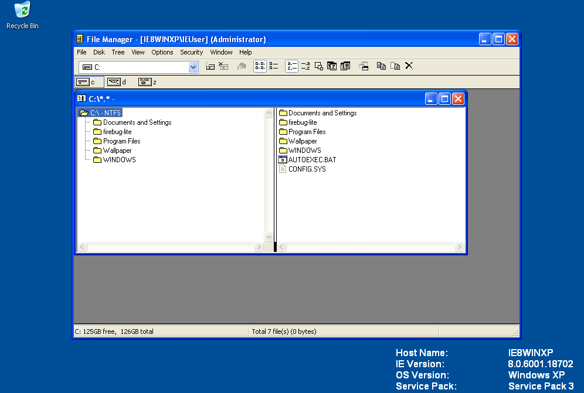

#  Windows File Manager (WinFile) for Windows XP (32-bit NT 5.1) thru Windows 10

The Windows File Manager lives again and runs as a native x86, now supporting Windows XP.
The goal of this project was to build a version of WinFile that would run fairly reliably on all versions of Windows from Windows XP SP3 (NT 5.1 32-bit) to Windows 10/11.
While there have been some forks that aimed to work on Server 2003/XP Professional x64 edition (NT 5.2), there was not a version that worked for Windows XP 32-bit based on NT 5.1

This current master was forked off from [maintainer Hermann Schinagl's excellent fork of the Microsoft trunk](https://github.com/schinagl/winfile) and contains changes/additions to WinFile over the years by many contributors.

I will consider bugs fixes and suggestions for minor changes to the master branch. Feel free to create a pull request or post issues as you see fit.

**NOTE**: support for versions of Windows older than XP / NT 5.1 is not the goal of this project, nor do I plan to test this on such systems. The binary may work on Win2k but will likely have more bugs.

## Download The App
See the [releases](https://github.com/wesinator/winfile_xp/releases)!

## Design changes and notes

To get this working for Windows XP, the main challenge was identifying APIs that were unsupported, and switching them out to dynamic loading of the addresses using `GetModuleHandleA`.
Fortunately, another (incomplete) fork started this work - https://github.com/blackwingcat/winfile_nt5/commit/e55dd95ea869383ad52c2bcbd58bf4f0ee0681d2

For this project, I created a separate header file `nt51_aliasing.h`, to make it easy to add necessary changes, and so that it is easier to track what changes were needed.

The following APIs were the main changes:
 - `GetLocaleInfoEx` and `LocaleNametoLCID` were changed to conditional dynamic loading.
 - `IO_REPARSE_TAG` definitions which are apparently used by tools such as OneDrive were hardcoded.
 - The Wow64Redirection APIs needed to be changed to dynamic loading, since 32-bit XP lacks these.
 - Symbolic linking that was introduced in NT6.0/Vista and [added to in Windows 10](https://blogs.windows.com/windowsdeveloper/2016/12/02/symlinks-windows-10/) needed to be defined.
 - `SetWindowTheme` which handles the window panes with the NT6+ theme was set to conditional dynamic loading, conditional on the presence of `uxtheme.dll` AND the GetModuleHandle call.

## Known issues
- Start PowerShell does not work on Windows XP
- Changing language/locales does not work on XP

All the functionality on Windows 7 (NT6.x) through Windows 10/11 is known to work.

------
# Winfile Info from Microsoft

## History
The Windows File manager was originally released with Windows 3.0 in the early 1990s.  You
can read more about the history at https://en.wikipedia.org/wiki/File_Manager_(Windows).

## What it looks like

## Changes in master v10.2.1.0
In summary, v10.2.1.0 has the following changes/new features:

1. OLE drag/drop support
2. control characters (e.g., ctrl+C) map to current shortcut (e.g., `ctrl+C` -> `copy` and copy path to clipboard)
instead of changing drives. Change drives now via CTRL + ALT + letter
3. cut (`ctrl+X`) followed by paste (`ctrl+V`) translates into a file move as one would expect
4. left and right arrows in the tree view expand and collapse folders like in the Explorer
5. added context menus in both panes
6. improved the means by which icons are displayed for files
7. F12 runs notepad or notepad++ on the selected file. Configure via Winfile.ini[Settings]EditorPath
8. moved the ini file location to `%AppData%\Roaming\Microsoft\WinFile`
9. File.Search can include a date which limits the files returned to those after the date provided;
the output is also sorted by the date instead of by the name
10. File.Search includes an option as to whether to include sub-directories
11. `ctrl+K` starts a command shell (ConEmu if installed) in the current directory; `shift+ctrl+K`
starts an elevated command shell (`cmd.exe` only)
12. File.Goto (`ctrl+G`) enables one to type a few words of a path and get a list of directories;
selecting one changes to that directory.  Default = c:\\. Configure via Winfile.ini[Settings]CachedPath
13. UI shows reparse points (e.g., Junction Points and Symbolic Links) as such with little icons.
14. added simple forward / back navigation (probably needs to be improved)
15. View command has a new option to sort by date forward (oldest on top); normal date sorting is newest on top; Icon in tool-bar available
16. CTRL + ENTER executes associated files as administrator
17. Symbolic Link directories/files and can be created by pressing CTRL + SHIFT during drag and drop of directories/files
18. Hardlinks and Junctions and can be created by pressing CTRL + SHIFT + ALT during drag and drop of directories/files
19. The delimiters for splitting words for the GotoCache can be configured via Winfile.ini[Settings]GotoCachePunctuation. The default is - _.
20. The scroll behavior of the treeview on expand can be configured via Winfile.ini[Settings]ScrollOnExpand. The default is to scroll.
21. Can handle paths up to 1024 characters with Windows10 >= 1607. Set HKLM\SYSTEM\CurrentControlSet\Control\FileSystem\LongPathsEnabled=1 as admin.
22. Japanese localisation with full-width katakanas
23. Create files with suffix '- Copy', when copying with (`ctrl+C`) -> (`ctrl+V`) in the same dir, or drag-copy with mouse onto empty space in same dir.
24. UNC Path support via CTRL-G. Shows up as 'digit drive' 0: - 9:. Select it either via CTRL-0 ... CTRL-9 or from drive drop-down. Remove UNC digit drive with CTRL-W
25. Current username is shown in caption.
26. Contains statically linked versions to be used for WinPE

## Contributing

### Contributor License Agreement
As mentioned above, this project welcomes contributions and suggestions.  Most contributions require you to agree to a
Contributor License Agreement (CLA) declaring that you have the right to, and actually do, grant us
the rights to use your contribution. For details, visit https://cla.microsoft.com.

When you submit a pull request, a CLA-bot will automatically determine whether you need to provide
a CLA and decorate the PR appropriately (e.g., label, comment). Simply follow the instructions
provided by the bot. You will only need to do this once across all repos using our CLA.

This project has adopted the [Microsoft Open Source Code of Conduct](https://opensource.microsoft.com/codeofconduct/).
For more information see the [Code of Conduct FAQ](https://opensource.microsoft.com/codeofconduct/faq/) or
contact [opencode@microsoft.com](mailto:opencode@microsoft.com) with any additional questions or comments.

## License
Copyright (c) Microsoft Corporation. All rights reserved.

Licensed under the [MIT](LICENSE) License.

[NO_TRAIN]::
